# ScrollSplice Progress Screenshots

These screenshots preserve dated, public-safe visual checkpoints from the Build Week implementation. They document what actually existed at each checkpoint and must not be used to imply that later planned features were already working.

## July 13 — First testable editor

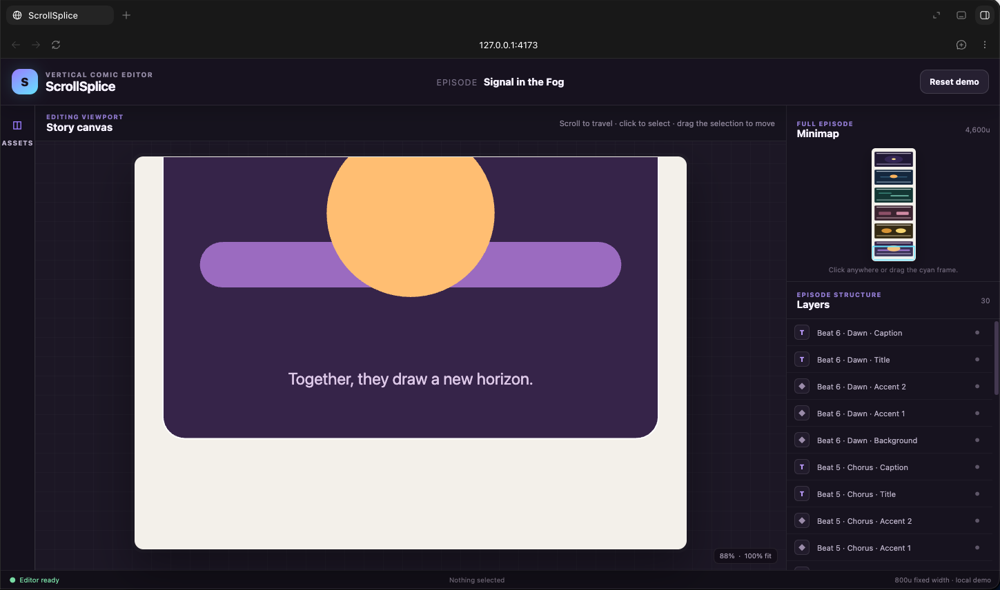

- Captured by Katherine from the running local app after her first hands-on product review.
- Shows the pre-composition-group workspace: viewport-sized story canvas, minimap, flat 30-layer list, collapsed Assets control, and the synthetic **Signal in the Fog** episode.
- Contains only the public-safe code-rendered fixture; no Root & Table production artwork or private creative material appears.
- Original Downloads filename: `Screenshot 2026-07-13 at 3.12.50 PM.png`.
- File: 1449 × 856 PNG, 136,249 bytes.
- SHA-256: `0f3142f89598d059e9ab2066047854c98056f2d144823135332d2992f6e0f7e1`.

## July 13 — Composition groups and visibility

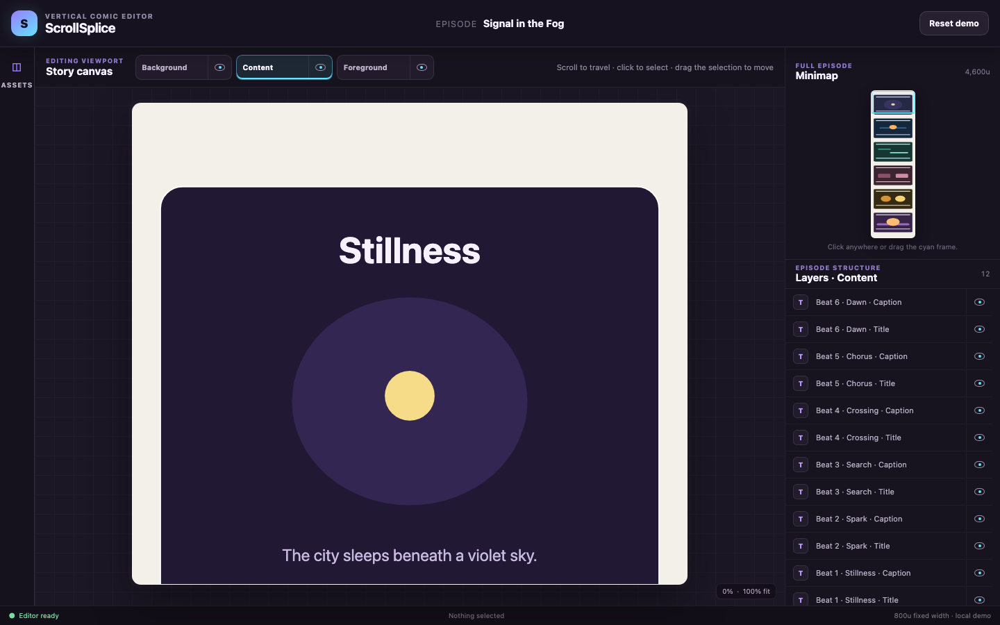

- Captured by Codex from the running `f02776f` checkpoint after Katherine's composition review and before the numbered layer-plane foundation began.
- Shows the Background, Content, and Foreground controls, Content-filtered element list with eye controls, synchronized minimap, viewport-sized canvas, and synthetic **Signal in the Fog** episode.
- Preserves the checkpoint's actual interim state: the right inspector has not yet moved to the top, numbered planes do not yet exist, and the white episode backdrop is still hardcoded.
- Contains only the public-safe code-rendered fixture; no Root & Table production artwork or third-party comic reference appears.
- Captured in bundled Chromium at a 1440 × 900 viewport.
- File: 1440 × 900 PNG, 118,503 bytes.
- SHA-256: `32ad4cf5dfa38826404703c3dc1bb2e66db2131b2e3085bb6c27db2631c95202`.

## July 13 — Numbered layer planes and editable backdrop

- Captured by Codex from the running `c5f83c5` checkpoint after the layer-plane slice passed validation.
- Shows the full-height right inspector, numbered Content-plane tabs, centered composition controls, synchronized minimap, viewport-sized canvas, and synthetic **Signal in the Fog** episode.
- Represents the implemented format-v3 state. Hidden elements remain selectable from Layers, the active plane is ordered from top to bottom on the scroll, and the backdrop is document data rather than a hardcoded renderer fill.
- Contains only the public-safe code-rendered fixture; no Root & Table production artwork or third-party comic reference appears.
- Captured in bundled Chromium at a 1440 × 900 viewport.
- File: 1440 × 900 PNG, 102,815 bytes.
- SHA-256: `d9688284f870786821a7cdf9c25010a21dac0f5dec1ecdfaf83561bea2da6d76`.

## July 13 — Episode setup and expandable scroll

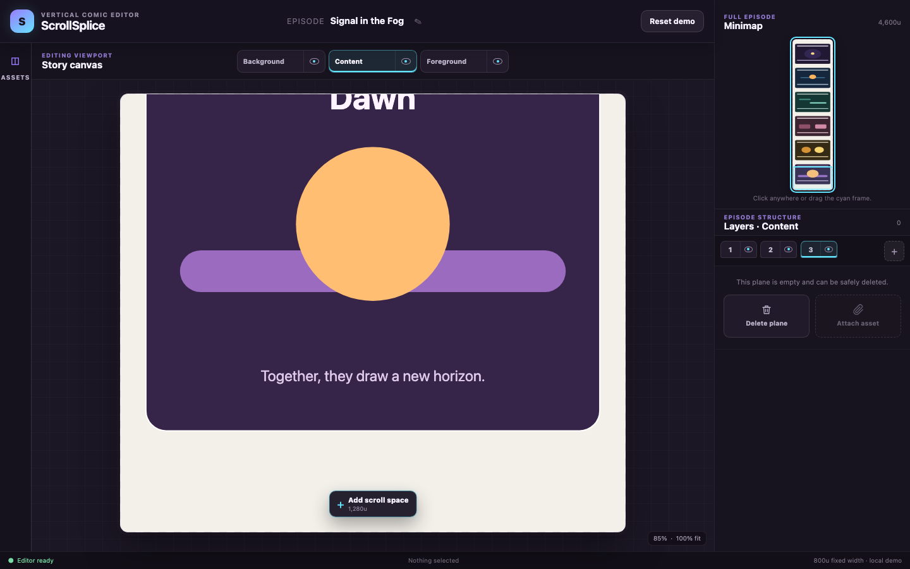

- Captured by Codex from the running local checkpoint after the Episode Setup and Expandable Scroll slice passed validation.
- Shows a newly created empty Content plane, its safe **Delete plane** action, the disabled future **Attach asset** paperclip, the direct-edit pencil beside the episode title, the bottom **Add scroll space** control, and the minimap fitted to the full episode.
- Preserves the interaction distinction: the numbered-tab `+` creates a plane, **Attach asset** is not functional yet, and **Add scroll space** extends the episode by 1,280 logical units.
- Contains only the public-safe code-rendered **Signal in the Fog** fixture; no Root & Table production artwork or third-party comic reference appears.
- Captured in bundled Chromium at a 1440 × 900 viewport during supported-size visual QA.
- File: 1440 × 900 PNG, 97,494 bytes.
- SHA-256: `007a46bf91815d4f78546d9a8561c6bb456ca4f8b3c7b12389ca3ec9e621bec3`.

## July 13 — Post-review expandable-scroll baseline

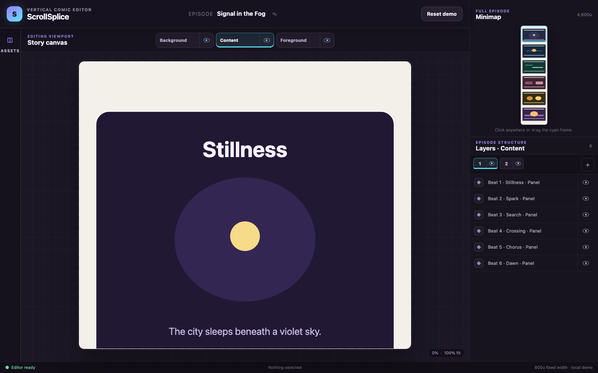

- Captured by Codex from the running local Episode Setup checkpoint after Katherine verified empty-plane deletion and minimap behavior following expansion, and before the next authorized A/B/C changes began.
- Shows populated Content plane 1, the synchronized full-episode minimap, the fixed-fit story canvas, and the direct-title pencil that the next checkpoint is approved to remove.
- This is baseline evidence, not evidence that click-to-edit title activation, element-row deletion, precise height dragging, movable Background color regions, or adjustable zoom already works.
- Contains only the public-safe code-rendered **Signal in the Fog** fixture; no Root & Table production artwork or third-party comic reference appears.
- Captured in bundled Chromium at a 1440 × 900 viewport.
- File: 1440 × 900 PNG, 103,161 bytes.
- SHA-256: `3513a6bcaec50ceb3ddeeb60bdbafa4fdd57db9fa503cce1b27c2345fc011820`.

## July 13 — Creator controls, height, and zoom

- Captured by Codex from the running local build after Direct Creator Controls, Safe Precise Height and Background Color Regions, and Canvas Zoom/2D passed validation.
- Shows the title as the edit target with no permanent pencil, a populated Content plane with its enabled **Add asset** paperclip, placed-element trash actions beside the eyes, the full-episode minimap, and the **Fit Width**-relative zoom controls.
- The same validated build also provides synchronized Layers/canvas base-color controls, code-defined synthetic demo placement, pointer/keyboard height fine-tuning, and solid movable Background color regions; those interactions are validated but are not all visible in this single top-of-episode frame.
- Contains only the public-safe code-rendered **Signal in the Fog** fixture; no Root & Table production artwork or third-party comic reference appears.
- Captured in bundled Chromium at a 1440 × 900 viewport after supported-size visual QA at 1440 × 900, 1280 × 720, and 1024 × 768.
- File: 1440 × 900 PNG, 108,387 bytes.
- SHA-256: `b6dcfc9bd7046a955ba06e19027b14bfae67b29f8bc58e277fe77b293301fe29`.
- Katherine reviewed this exact build on July 14 and confirmed that placed-element deletion, the bottom **Add asset** action, expanded-height minimap behavior, and ordinary element movement work.
- The review also identified the title-input header shift and horizontally janky full-width Background-region drag, and requested default-on alignment help plus editor-only WEBTOON candidate-boundary guides. Those are follow-up findings, not features visible or claimed in this screenshot.
- This validated checkpoint and its documentation were published to `main` through `8a493a2` on July 14. This screenshot does not imply deployment or Devpost submission.

## July 14 — Stable editing, candidate guides, and bounded resize

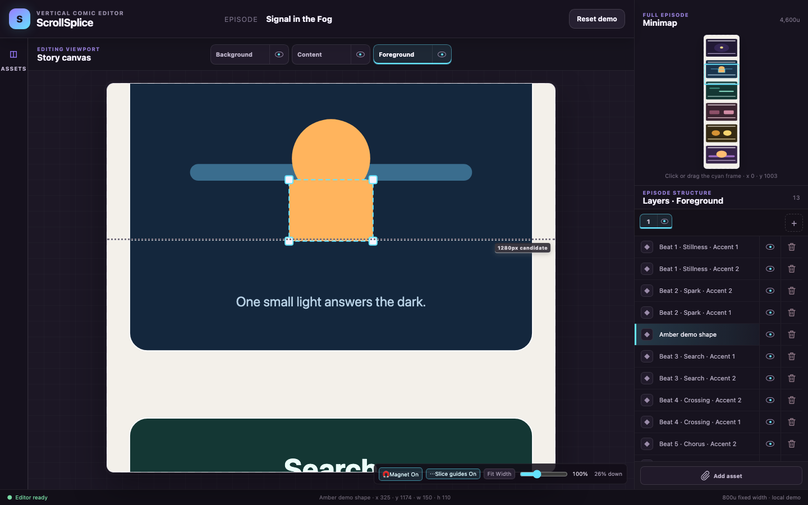

- Captured by Codex from the running local corrective checkpoint after Katherine failed the prior manual review on title stability, missing guides/magnet, live Background-region drift, and missing corner resize handles.
- Shows a selected code-defined **Amber shape** with four proportional corner handles near the dotted 1,280-unit candidate boundary, plus the visible default-on **Magnet** and **Slice guides** controls.
- The dotted line is explicitly a provisional candidate derived from the `form-observed` WEBTOON profile. It is editor chrome, not a produced slice, export result, compatibility guarantee, minimap element, or document element.
- This image records the now-historical fixed-width corrective checkpoint. Its `x = 0`, no-Background-resize behavior was later superseded by free Background-region movement and eight independent handles; the screenshot remains useful evidence for the stable title, guides, magnet, and ordinary four-corner resize stage.
- Contains only the public-safe code-rendered **Signal in the Fog** fixture and a code-defined synthetic Amber rectangle; no Root & Table production artwork, private creative material, or third-party comic reference appears.
- Captured in bundled Chromium at a 1440 × 900 viewport. The later superseding corrective build passed its automated regression, supported-size visual validation, and Katherine's human retest with minimap aspect distortion logged as polish. This screenshot did not imply publication at capture time; the checkpoint was later incorporated into the July 15 stack published in `fdd4ead`. It still does not imply deployment or submission.
- File: 1440 × 900 PNG, 132,504 bytes.
- SHA-256: `798992900f6a899378d07155a5eeb5f5eadc204e6661d3262ac0435b180489cc`.

## July 14 — Local save, history, and minimal menus

- Captured by Codex from the running local build after the optional history/save/menu slice passed automated and supported-size visual validation.
- Shows the exact **File** menu—**New Episode**, **Save**, and **Reopen**—with the selected public-safe synthetic fixture, transform handles, Layers panel, full-episode minimap, and bottom **Saved locally** status.
- The same validated slice provides **Edit > Undo / Redo**, bounded document history, one explicit versioned local-browser save, page-reload restoration, confirmed Reopen, and a blank New Episode. Those state transitions are proved by the two Playwright Chromium tests, not by this single still image.
- Contains only the public-safe code-rendered **Signal in the Fog** fixture; no Root & Table production artwork, private creative material, or third-party comic reference appears.
- Captured in bundled Chromium at a 1440 × 900 viewport after visual inspection at 1440 × 900, 1280 × 720, and 1024 × 768.
- File: 1440 × 900 PNG, 126,756 bytes.
- SHA-256: `53a443469634c0b24c510bfc35cb7a2b14809d444fa678bb5a8ff16f69e49125`.
- Katherine completed the hands-on review July 15 and reported that the tested history/save/menu workflow works well. The screenshot itself does not imply deployment, submission, portable project files, or crash recovery.

## July 15 — Persistent Asset Library and image elements

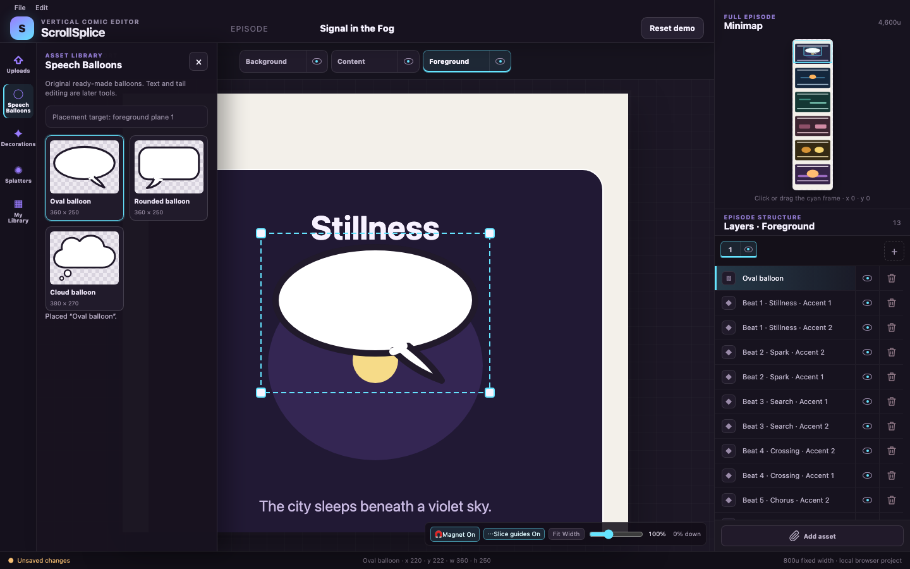

- Captured by Codex from the running local build during final persistent Asset Library validation.
- Shows the fixed five-destination Add rail, overlay **Speech Balloons** library, three original transparent starter balloons, an **Oval balloon** placed on Foreground plane 1, its four proportional corner handles, matching Layers row, and synchronized minimap representation.
- The same build provides original Decorations and Splatters, creator-named categories inside **My Library**, validated PNG/JPEG/WebP import with alpha preserved, atomic concurrent-tab IndexedDB source updates, current-tab refresh from the returned saved snapshot, clear refusal for unplaceable extreme source ratios, format-v4 image references, and v3-to-v4 episode opening. The focused Chromium story proves alpha against sampled underlying canvas pixels and verifies uploaded-image resize through undo/redo, Save, reload, and Reopen; those state transitions are automated evidence rather than claims derived from this still image.
- The balloon is intentionally a simple visual asset. Independent text was not part of this historical slice; compound balloon/text behavior, automatic fitting, tail editing, recoloring, crop, and rotation remain deferred.
- Contains only the original public-safe code-rendered **Signal in the Fog** fixture and ScrollSplice's original built-in balloon; no Root & Table production artwork, private creative material, or third-party comic reference appears.
- Captured in bundled Chromium at a 1440 × 900 viewport.
- File: 1440 × 900 PNG, 174,153 bytes.
- SHA-256: `c350fbc0bfb0d9a14507dc5fe5940584aaa38d3210dcf5bd0efc594647b46fbc`.

## July 15 — Menu and Asset Library review polish

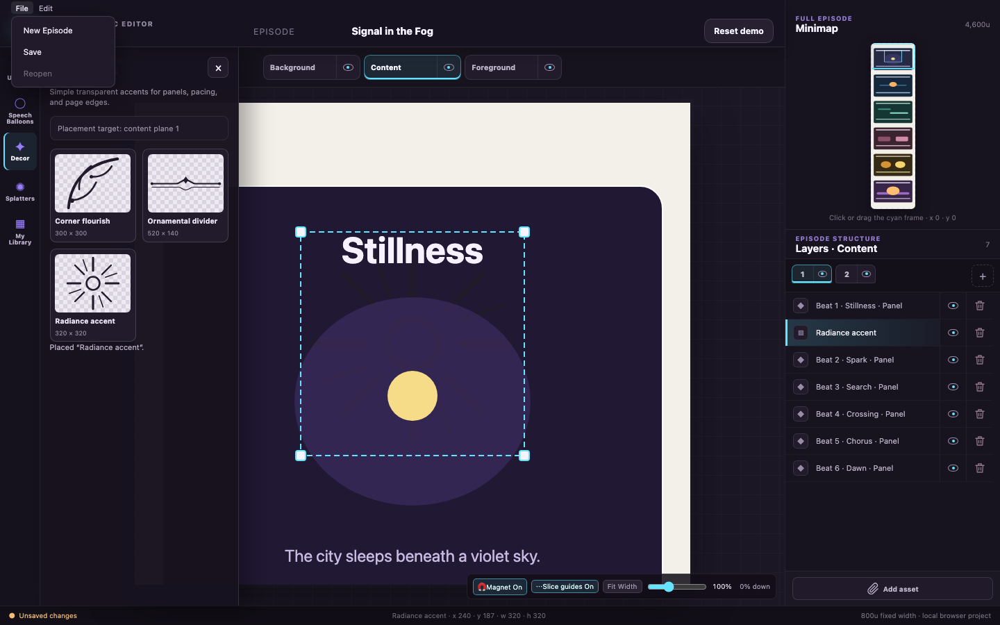

- Captured from a fresh bundled-Chromium context after Katherine's first Asset Library review; it does not contain her uploaded image or browser-profile data.
- Shows the **File** menu visibly above the open Asset Library, the compact visible **Decor** rail label, the public-safe synthetic **Signal in the Fog** fixture, and ScrollSplice's original Radiance accent with proportional resize handles.
- The Chromium regression also hit-tests and clicks **Save** where the menu overlaps the open drawer, then clicks the active Decorations category a second time and confirms the drawer closes. Those interactions are automated evidence, not claims inferred from the still image.
- Katherine's upload, placement, alpha, and resize checks passed. The visible white seam in the original Oval and Rounded balloon outline artwork is separately recorded as later polish.
- File: 1440 × 900 PNG, 153,678 bytes.
- SHA-256: `aa160a27ef595f06b8f93261c595851b7f8fca0a70a3224b114d478ba7e1d3d7`.
- Published and verified on local and remote `main` in `3ec9bd095fab5ba2fb19f9d97cfeb79fcdbceae5`.

## July 15 — Direct placement and appearance controls

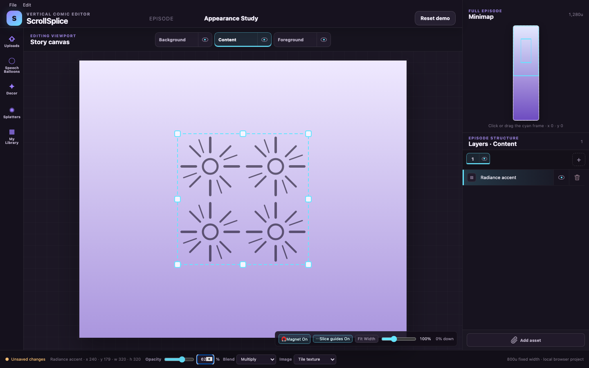

- Captured from the running local build after the direct-placement and foundational-appearance goal passed local validation, then visually inspected.
- Shows a public-safe synthetic blank episode with ScrollSplice's original built-in **Radiance** asset and its appearance controls. It contains no uploaded user art, Root & Table production artwork, private creative material, or third-party comic reference.
- The same build supports native drag-to-canvas placement for original built-ins and imported assets, with click placement retained as an accessible fallback. Existing PNG/JPEG/WebP import, source-alpha preservation, and Background plane 2-or-later photo placement remain confirmed; Background plane 1 remains the color-only base.
- Format v5 adds universal element opacity with one history entry per gesture, vertical two-stop color-and-alpha gradients, single/tile image presentation with a fixed automatic scale capped at a 160-logical-unit tile edge, and exactly Normal, Multiply, Screen, Overlay, and Soft Light blend modes. The canvas, minimap, persistence, and history share that state.
- Local validation passes 255 unit tests across 13 files, strict typecheck, ESLint, production build, targeted drag/appearance Chromium coverage, and the repaired full Playwright Chromium suite at 6/6. Those interaction and persistence claims come from automated evidence, not from the still image alone.
- Balloon-outline seam cleanup and minimap aspect distortion remain deferred polish.
- File: 1440 × 900 RGB PNG, 124,384 bytes.
- SHA-256: `c0b9bc5a359d23035cd965001b5f1e51056ee08cd87a0a36093771096ab7e4e3`.
- The implementation, documentation, and screenshot were published in feature commit `7768daa0617b66c696f769d97dd531f9029272c8`. This checkpoint does not imply deployment or Devpost submission.

## July 16 — Creator completion pass

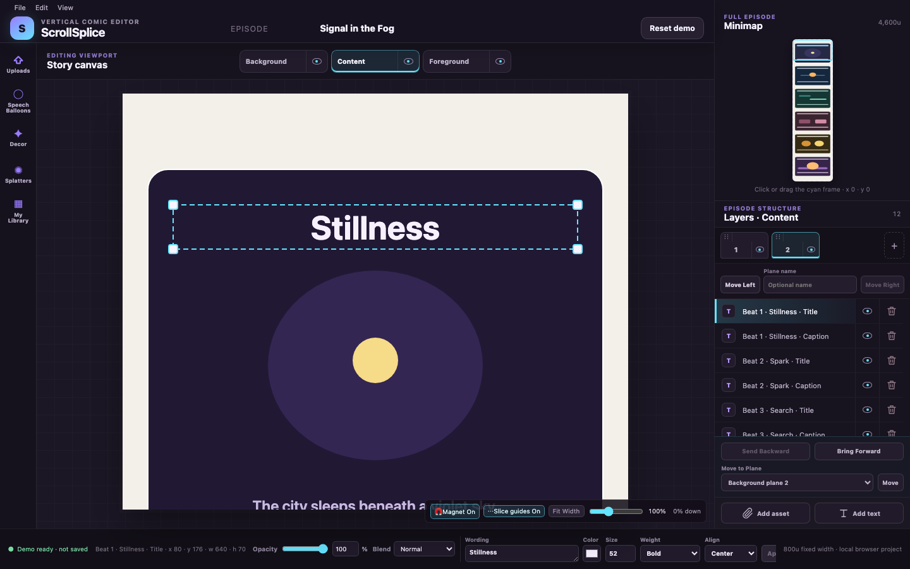

- Captured from a fresh bundled-Chromium context after the three creator-completion slices were implemented and visually inspected.
- Shows the public-safe **Signal in the Fog** fixture with its first title selected on the optionally named **Lettering and captions** plane. The frame includes dedicated plane drag grips, Move Left/Right, local stack actions, Move to Plane, Add asset/Add text, the selected text property strip, and the new **View** menu entry point.
- The same build provides same-group plane drag reordering with a pinned Background base, independent basic text, a chrome-free full-scroll Reader Preview, and a cancelable dirty-work warning for Reset Demo. The creator-story browser test exercises plane reordering, persists representative plane naming and text properties through Save, reload, and Reopen, then separately proves saved-slot recovery after a confirmed reset.
- Contains only the public-safe code-rendered fixture; no uploaded user art, Root & Table production artwork, private creative material, or third-party comic reference appears.
- Local validation passes 270 unit tests across 13 files, strict typecheck, ESLint, production build, and the complete 7-of-7 Playwright Chromium suite. Visual inspection also confirmed Reader Preview at a representative desktop size. The passing build retains Vite's non-blocking advisory for its 637.55 kB minified JavaScript chunk.
- File: 1440 × 900 PNG, 143,201 bytes.
- SHA-256: `05da8ce3c827e474506927f4d556b70ac277ef7b78dbfba8875b370903f6185c`.
- The implementation, documentation, and screenshot were published in feature commit `cb1f28443f7b1045d139879a2bba7b03edf25856`; local and remote `main` matched immediately after the push.
- WEBTOON export, OpenAI/OAuth, Finder drop, autosave/recovery, source deletion, masks, crop, rotation, and compound balloon/tail editing remain deferred. This checkpoint does not imply deployment or Devpost submission.

## July 16 — Complete local human editor

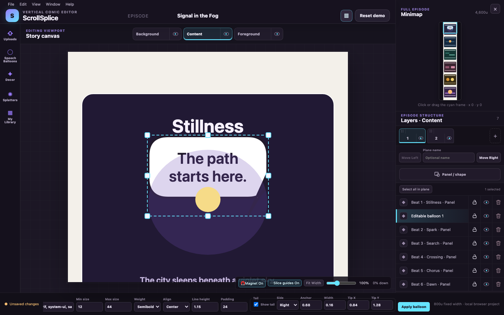

- Captured after the broad human-editor implementation and before it was recorded in local feature commit `a26927f`.
- Shows the public-safe **Signal in the Fog** fixture plus ScrollSplice's code-defined editable balloon, current File/Edit/View/Window/Help surface, responsive inspector, minimap, numbered planes, Layers actions, and selected-element controls.
- The same working build includes Finder/canvas/plane/Layers image drop, complete local category/source management, multiple/recovery/portable projects, bounded format-v6 transforms and flat groups, image crop/masks/frame/bleed, atomic editable balloon text/tail fitting, and provisional local rendering. Those behaviors require tests and the feature sheet; this still image alone does not prove them.
- Contains no Root & Table production artwork, user upload, private creative material, or third-party comic reference.
- File: 1440 × 900 PNG, 161,742 bytes.
- SHA-256: `47a4aa54e64e836c792e25ef84e84e5a19ca51e8786b9c1bd0c3c7a9633c5f82`.
- The complete local stack passes 377 unit tests, typecheck, lint, build, and all 13 Playwright Chromium stories. The matching feature commit `a26927f` was later included in the July 19 big feature and UI publication.

## July 16 — Complete Reader Preview

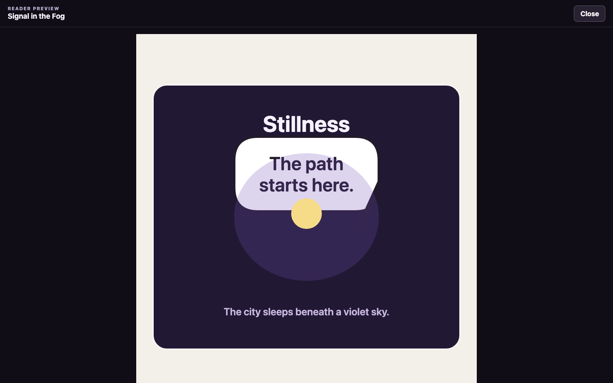

- Captured from the same public-safe build now recorded in local feature commit `a26927f`.
- Shows the chrome-free full-scroll Reader Preview used to compare durable geometry, visibility, appearance, masks, text, and the atomic editable balloon against the editor and renderer.
- Reader Preview is local product evidence, not a WEBTOON preview or public deployment.
- File: 1440 × 900 PNG, 45,519 bytes.
- SHA-256: `6a4ab652e790a2e4fd31c364a3dc436e26bf549859218d75c01b1bd3f11ffdb4`.
- The complete local stack passes 377 unit tests, typecheck, lint, build, and all 13 Playwright Chromium stories. The matching feature commit `a26927f` was later included in the July 19 big feature and UI publication.

## July 16 — Provisional local export

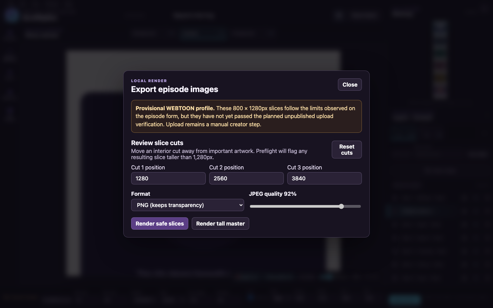

- Captured from the same public-safe build now recorded in local feature commit `a26927f`, with only the synthetic fixture and code-defined editable balloon.
- Shows the local episode-image dialog, creator-reviewed cut controls, PNG/JPEG settings, render actions, and the prominent warning that the 800 × 1,280 profile comes from the observed form and has not passed the unpublished upload verification. The later rendered-file list and preflight state are covered by browser tests rather than this pre-render still.
- This image proves that the local UI exists; it does **not** prove WEBTOON acceptance, byte preservation, preview accuracy, or an upload-verified/guaranteed-WEBTOON-ready package. Upload remains manual.
- File: 1440 × 900 PNG, 197,505 bytes.
- SHA-256: `c21b04b1298b202bae65040ae0e8701e5c4f839e190bc953dcf1afb4e2e08915`.
- The complete local stack passes 377 unit tests, typecheck, lint, build, and all 13 Playwright Chromium stories. The matching feature commit `a26927f` was later included in the July 19 big feature and UI publication.

## July 19 — Big feature/UI release, dark appearance

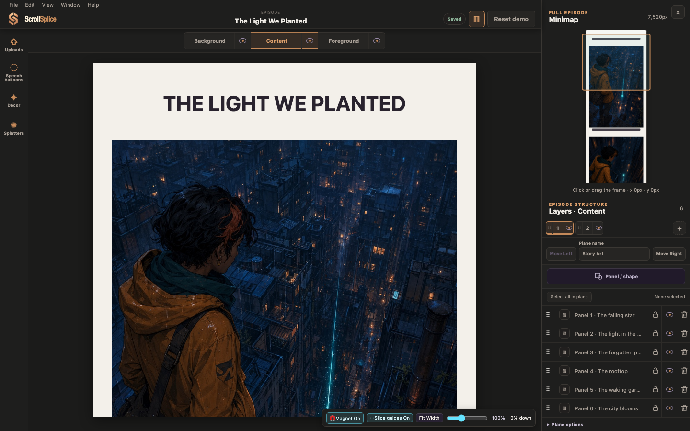

- Captured from a fresh bundled-Chromium context at 1440 × 900 after the current big feature/UI release passed its browser gate.
- Shows the Graphite/Copper dark appearance, the in-repository six-image **The Light We Planted** story, compact draggable Story Art rows, visible inspector, larger scrollable minimap, and the intentionally expanded viewport frame.
- Contains only original OpenAI-generated story art created for ScrollSplice plus project-owned UI/branding; no Root & Table production art, private upload, or third-party comic reference appears.
- File: 1440 × 900 PNG, 868,237 bytes.
- SHA-256: `f2f3df79c46a8b200503dc93bef310124a694b76beeda07d808aa14689cef0f4`.

## July 19 — Big feature/UI release, light appearance

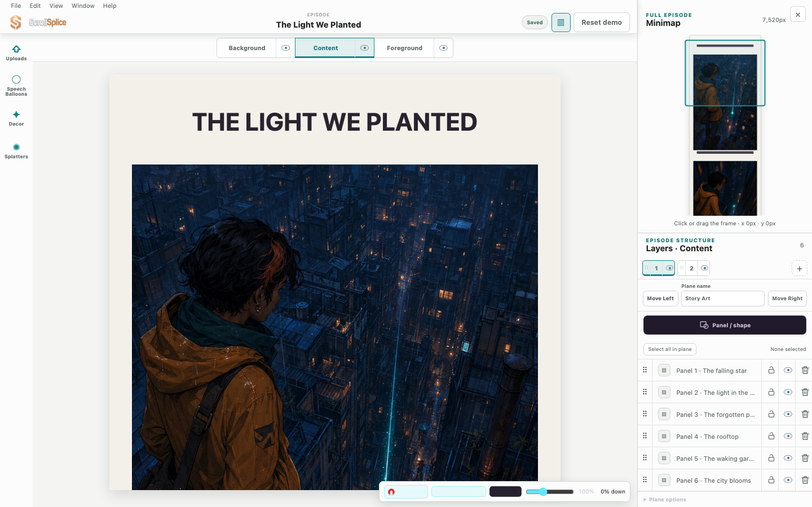

- Captured from a separate fresh bundled-Chromium context with the same 1440 × 900 viewport, episode, and editor state as the dark evidence.
- Shows the Bright Studio light appearance without changing document data, layout, story assets, minimap position, or layer organization.
- Contains only original OpenAI-generated story art created for ScrollSplice plus project-owned UI/branding; no Root & Table production art, private upload, or third-party comic reference appears.
- File: 1440 × 900 PNG, 869,612 bytes.
- SHA-256: `1cb823648159d9f44923f8e2c93bfa0d935767875e15f2e5a21dd3501071b0ec`.

The release passes 385 unit tests across 29 files, strict typecheck, ESLint, the production build, and all 15 Playwright Chromium stories. The still images document the two interface appearances; interaction behavior is supported by the automated and hands-on evidence elsewhere in this repository.
